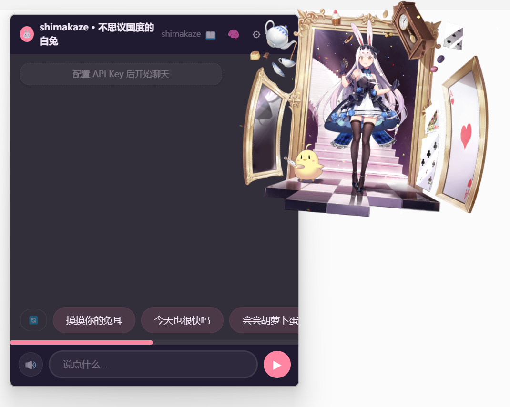

# 🤖 AI Pet - 你的 Live2D 桌面角色

基于 **LangGraph** + **LangChain** 的桌面 AI 角色，Live2D 动画 + LLM 驱动对话。
碧蓝航线角色：大鳳（航空母舰）/ 岛风（驱逐舰）等多角色支持。

## 📸 截图



## ✨ 功能

- 💬 **角色扮演对话**：LLM 驱动，支持 DeepSeek / OpenAI / 自定义兼容 API
- 🖱 **触摸互动**：双击摸头/身体 → Live2D 动画 + 角色配音，拖拽触发 drag 反应
- 🔊 **音频反馈**：每个触摸区域配 .ogg/.mp3，随机播放，支持静音 + 音量调节
- 🔄 **对话隔离**：切换角色/皮肤自动开新对话，旧对话保留
- 🎨 **毛玻璃 UI**：深色 / 浅色双主题，樱花粉 / 海洋蓝角色色系
- 💡 **快捷回复**：LLM 根据角色性格动态生成主人→角色的快捷句子
- 📦 **即插即用**：角色文件夹放入 `ui/model/` 自动识别
- 👗 **角色变体**：同一角色多皮肤（不同服装），人设共享，Live2D 独立
- 🧠 **三层记忆**：核心事实 + 近期偏好 + 情境记忆，自动衰减晋升
- 📖 **角色日记**：每日自动生成角色口吻的日记
- ⚙ **设置留存**：配置保存到本地，下次自动加载
- 🔧 **手感系统**：弹簧按钮 + 磁吸光晕 + 音频触感反馈

## 🚀 快速开始

```bash
pip install -r requirements.txt
python main.py
```

首次启动弹出设置面板：

```
1. 选择 API 提供商
2. 填入 API Key
3. 选择模型
4. 点击「测试连接」
5. 点击「保存」
```

## 📂 项目结构

```
ai-pet/
├── main.py                 ← 启动入口
├── config.py               ← 全局配置
├── agent/                  ← 大脑层
│   ├── brain.py            │  门面：聊天/互动/记忆/日记
│   ├── llm_factory.py      │  LLM 构建
│   ├── memory.py           │  三层记忆管理（core/preference/episodic）
│   ├── diary.py            │  日记系统
│   ├── interaction.py      │  交互动作 / 每日回顾 / 快捷回复
│   ├── personality.py      │  角色卡加载（system + persona + interactions）
│   ├── state.py            │  状态定义
│   ├── logger.py           │  结构化日志（模块独立文件）
│   └── graph/              │  LangGraph 图
│       ├── builder.py      │    图构建 + SQLite + WAL
│       ├── prompt.py       │    prompt 拼接 + 记忆分层注入
│       ├── executor.py     │    LLM 执行 + JSON 解析
│       ├── persister.py    │    invoke / get_state / close
│       └── logger.py       │    prompt 日志存盘
├── bridge/                 ← 前后端通信
│   ├── handler.py          │  JS API 路由
│   ├── interaction.py      │  对话/互动/回顾/日记桥接
│   ├── settings.py         │  配置存取 + Brain 生命周期
│   ├── connection.py       │  LLM 连接测试
│   ├── windows.py          │  窗口显示控制 + 退出
│   ├── models.py           │  Live2D 模型扫描 + 切换
│   ├── autostart.py        │  开机自启管理
│   ├── audio.py            │  音频文件解析
│   ├── memory_api.py       │  记忆 CRUD 桥接
│   ├── updater.py          │  GitHub 版本检测
│   └── utils.py            │  工具函数
├── tray.py                 ← 系统托盘
├── ui/                     ← 前端
│   ├── pet.html            │  角色窗口（Live2D + 触摸事件）
│   ├── chat.html           │  聊天窗口（对话 + 设置 + 记忆 + 日记）
│   ├── css/
│   │   ├── base.css        │  CSS 变量 + 主题系统
│   │   ├── chat.css        │  聊天窗口 + 气泡 + 快捷回复
│   │   └── panels.css      │  设置/记忆/日记面板 + toggle
│   ├── js/
│   │   ├── bridge.js       │  pywebview API 封装
│   │   ├── haptics.js      │  手感系统（弹簧 + 磁吸 + 音频）
│   │   ├── common.js       │  全局状态 + 主题/音量
│   │   ├── message.js      │  气泡消息渲染
│   │   ├── idle.js         │  空闲检测 + 主动搭话
│   │   ├── notify.js       │  桌面通知
│   │   ├── memory-panel.js │  记忆面板（三色标签 + 强度条）
│   │   ├── setup-ui.js     │  设置面板
│   │   ├── chat.js         │  聊天主控 + 模型菜单 + 日记面板
│   │   ├── live2d.js       │  Live2D 加载/切换/Motion
│   │   ├── pet-ui.js       │  触摸检测 + 拖拽 + 音频
│   │   └── lib/            │  PIXI + Live2D SDK
│   └── model/
│       ├── MODEL_GUIDE.md  │  添加新角色规范
│       ├── taihou/         │  大鳳 · 航空母舰
│       │   ├── persona.txt │    人设
│       │   ├── system.txt  │    安全护栏
│       │   ├── interactions.json │  触摸交互配置
│       │   ├── variants.json
│       │   ├── 毒苹果/     │    变体皮肤
│       │   └── 放学后的甜蜜时光 / │ 变体皮肤
│       └── shimakaze/     │  岛风 · 驱逐舰
│           ├── persona.txt │    人设
│           ├── system.txt  │    安全护栏
│           ├── interactions.json │  触摸交互配置
│           ├── variants.json
│           └── 不思议国度的白兔 / │ 变体皮肤
└── screenshots/
```

## 🎯 添加新角色

只需放入 `ui/model/新角色名/` 即可自动识别，详见 [MODEL_GUIDE.md](ui/model/MODEL_GUIDE.md)。

**单形态**：
```
ui/model/新角色/
├── 角色.model3.json
├── persona.txt / system.txt / interactions.json
├── audio/ (可选)
├── textures/ / motions/
```

**多皮肤**（添加 `variants.json`）：
```
ui/model/新角色/
├── persona.txt / system.txt
├── interactions.json (共享回退)
├── variants.json
├── 皮肤A/
│   ├── *.model3.json / *.moc3
│   ├── interactions.json (可选)
│   ├── audio/ textures/ motions/
└── 皮肤B/ ...
```

## 🔊 音频

音频文件放入 `audio/` 目录，`.ogg/.mp3/.wav`，在 `interactions.json` 的 `zones[].audio` 数组引用：

```json
{ "zones": [{ "id": "body", "audio": ["Touch.ogg", "Idle1.ogg"] }] }
```

## 📦 打包

```bash
.venv\Scripts\python.exe -m PyInstaller build.spec
```

## 🧪 测试

```bash
pytest tests/
ruff check agent/ bridge/ config.py main.py
```

## 🔧 技术栈

- **Agent**: LangGraph（有状态图编排）
- **LLM**: LangChain + OpenAI 兼容 API
- **窗口**: pywebview（双 frameless 窗口）
- **Live2D**: PIXI.live2d + Cubism 4 SDK
- **日志**: 模块独立文件 + 集中错误日志
- **Lint**: Ruff
- **打包**: PyInstaller

## 📄 License

MIT
