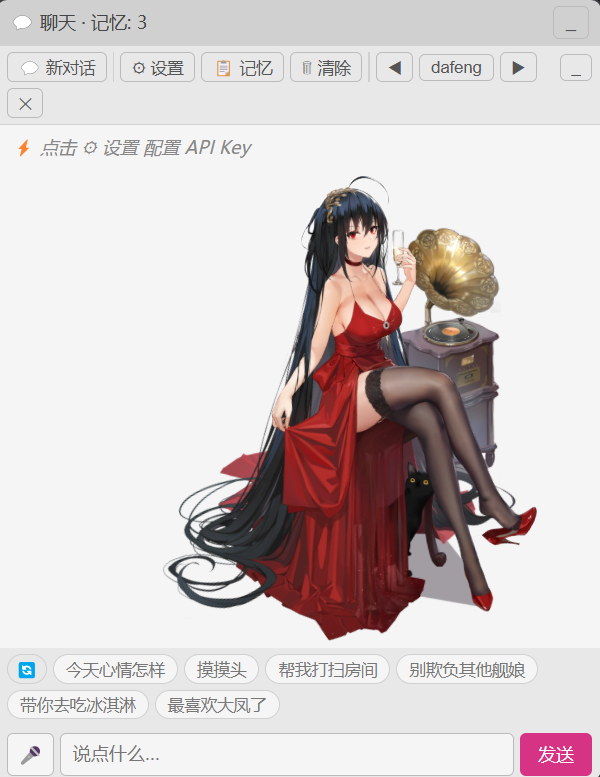

# 🐱 AI Pet - 你的 Live2D 桌面宠物

基于 **LangGraph** 的桌面宠物，Live2D 动态角色 + LLM 驱动对话。

## ✨ 功能

- 💬 **智能聊天**：角色扮演式对话，支持 DeepSeek / OpenAI / 自定义 API
- 🖱 **触摸交互**：双击摸头/身体 → Live2D 动画 + 角色台词，拖拽触发 drag 反应
- 🔊 **触摸音频**：每个触摸区域配 mp3，随机播放（可选）
- 🔄 **对话隔离**：切换角色自动开新对话，旧对话保留
- 🎨 **双主题**：深色 / 浅色 / 跟随系统
- 💡 **快捷回复动态化**：点击 🔄 基于角色性格 LLM 生成主人→角色的快捷句子
- 📦 **新角色即插即用**：放入 `ui/model/` 自动识别，详见 `ui/model/MODEL_GUIDE.md`
- 🧠 **长期记忆**：跨会话记住主人的喜好
- 🔌 **多 API 支持**：DeepSeek / OpenAI / 自定义兼容 API
- ⚙ **设置留存**：配置保存到本地，下次自动加载

## 📸 界面截图



## 🚀 快速开始

```bash
pip install -r requirements.txt
python main.py
```

首次启动弹出设置面板：

```
1. 选择 API 提供商
2. 填入 API Key
3. 选择模型
4. 点击「测试连接」
5. 点击「保存并开始」
```

设置保存到本地，下次自动加载。

## 📂 项目结构

```
ai-pet/
├── main.py                 ← 启动入口
├── config.py               ← 所有配置
├── agent/                  ← 宠物大脑（LangGraph）
│   ├── brain.py            │  门面
│   ├── llm.py              │  LLM 构建
│   ├── graph.py            │  LangGraph 图定义
│   ├── interaction.py      │  交互动作 / 每日回顾 / 快捷回复生成
│   ├── personality.py      │  人设 + 交互配置加载
│   ├── memory.py           │  长期记忆管理
│   ├── state.py            │  状态定义
│   └── logger.py           │  统一日志
├── bridge/                 ← 前后端通信
│   ├── handler.py          │  JS API 路由
│   ├── interaction.py      │  对话/互动/音频/TTS
│   ├── settings.py         │  配置存取 & 连接测试
│   ├── windows.py          │  窗口控制 & 模型切换
│   ├── memory_api.py       │  长期记忆 CRUD
│   ├── updater.py          │  GitHub 版本检测
│   └── utils.py            │  共享工具函数
├── tray.py                 ← 系统托盘
├── ui/                     ← 前端
│   ├── pet.html            │  宠物窗口（Live2D 渲染 + 触摸事件）
│   ├── chat.html           │  聊天窗口（对话 + 设置 + 快捷回复）
│   ├── css/pet.css         │  样式（CSS 变量主题）
│   ├── js/
│   │   ├── bridge.js       │  pywebview API 封装
│   │   ├── common.js       │  全局状态 + 主题应用
│   │   ├── message.js      │  消息渲染 + 新对话
│   │   ├── idle.js         │  空闲检测
│   │   ├── voice.js        │  语音输入
│   │   ├── notify.js       │  桌面通知
│   │   ├── memory-panel.js │  记忆面板
│   │   ├── setup-ui.js     │  设置面板
│   │   ├── chat.js         │  聊天主控
│   │   ├── live2d.js       │  Live2D 加载/切换/Motion
│   │   ├── pet-ui.js       │  触摸命中检测 + 拖拽 + 音频
│   │   └── lib/            │  第三方库
│   └── model/
│       ├── MODEL_GUIDE.md  │  添加新角色规范
│       └── dafeng/         │  角色：航空母舰大凤
│           ├── system.txt  │    安全护栏
│           ├── persona.txt │    角色设定
│           ├── interactions.json │ 触摸交互配置
│           ├── audio/      │    触摸语音 mp3（可选）
│           ├── textures/   │    模型贴图
│           └── motions/    │    动作文件
└── screenshots/            ← 界面截图
```

## 🎯 添加新角色

只需放入 `ui/model/新角色名/` 即可自动识别，无需修改其他文件。详见 [MODEL_GUIDE.md](ui/model/MODEL_GUIDE.md)。

```
ui/model/新角色/
├── 角色.model3.json        # [必须] Live2D 模型入口
├── persona.txt             # [必须] 角色性格
├── system.txt              # [必须] 安全规则
├── interactions.json       # [必须] 触摸配置
├── audio/                  # [可选] 触摸语音 mp3
├── textures/               # [必须] 贴图
└── motions/                # [必须] 动作文件
```

## 📦 打包 EXE

```bash
# 使用 venv（避免引入多余包）
.venv\Scripts\python.exe -m PyInstaller build.spec
# 输出: dist/AI-Pet.exe
```

## 🧪 测试

```bash
ruff check agent/ bridge/ config.py main.py
```

## 🔧 技术栈

- **Agent**：LangGraph（有状态图编排）
- **LLM**：LangChain + OpenAI 兼容 API
- **桌面窗口**：pywebview（双 frameless 窗口）
- **Live2D**：PIXI.live2d + Cubism 4 SDK
- **日志**：Python logging（stdout + 日志文件）
- **Lint**：Ruff
- **打包**：PyInstaller

## 📄 License

MIT
